#  Personal Portfolio Website

A modern and responsive portfolio website built to showcase my projects, skills, and experience as a **Python Full Stack Developer**.

 **Live Website:**  
https://portfolio-o5cw.onrender.com/


##  Features

-  Modern UI with clean design
-  Fully responsive (mobile + desktop)
-  About me section
-  Skills showcase
-  Projects section with live demos
-  Contact form with email integration
-  Fast and optimized performance


##  Tech Stack

### Frontend
- React (Vite)
- TypeScript
- JavaScript
- Tailwind CSS

### Backend
- Django
- Django REST Framework (DRF)

### Database
- MySQL

### Other Tools
- Axios
- EmailJS


##  Screenshots

###  Dark vs Light Mode

| Section       |  Dark Mode |  Light Mode |
|--------------|------------|-------------|
| About        | 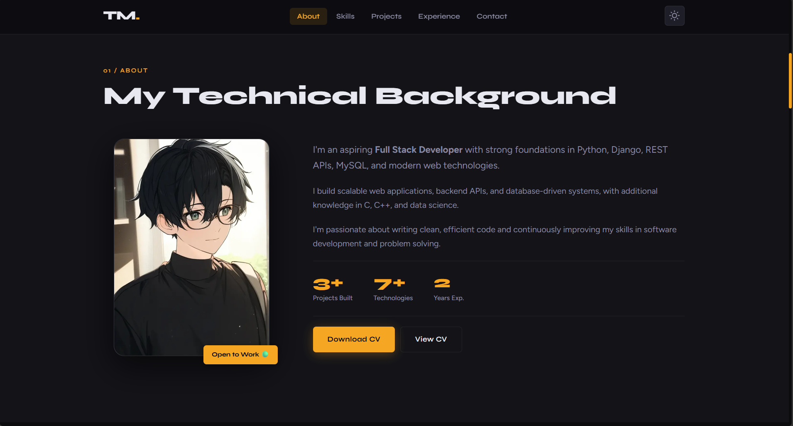 | 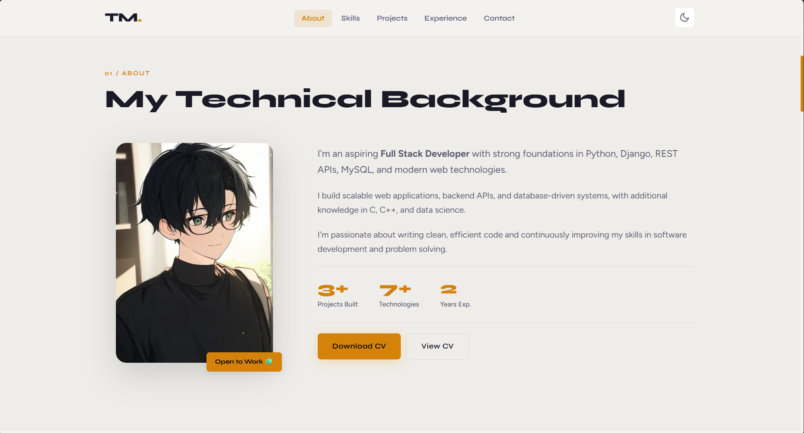 |
| Contact      | 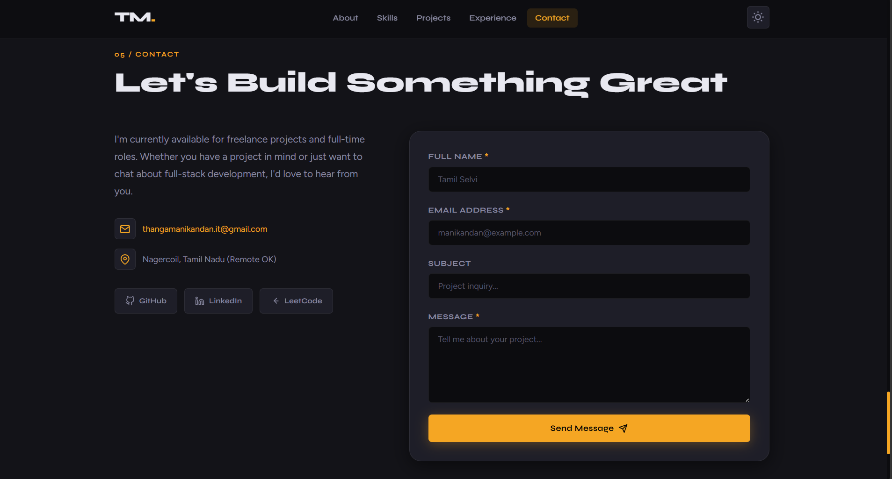 | 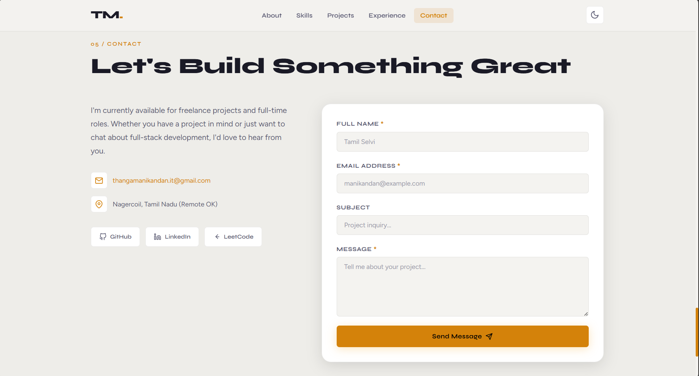 |
| Dashboard    | 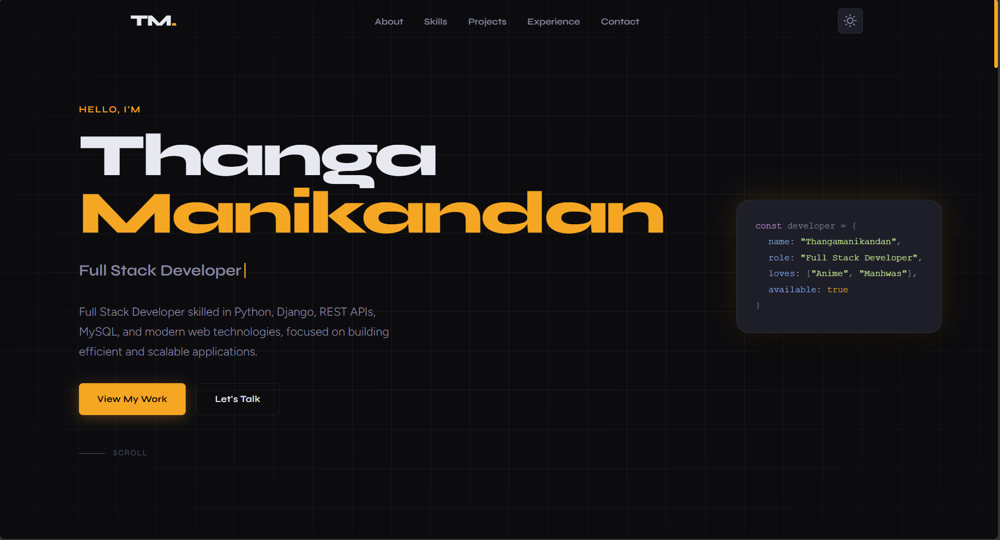 | 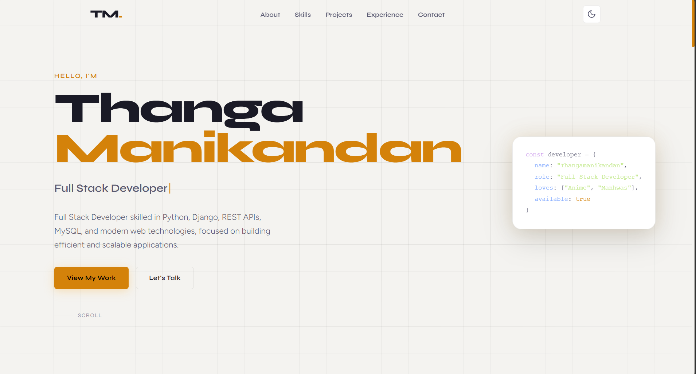 |
| Experience   | 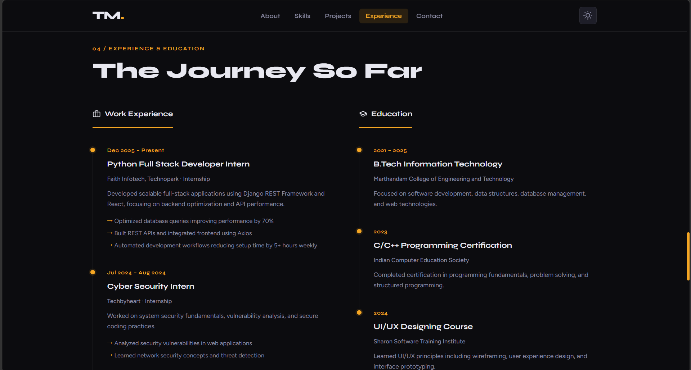 | 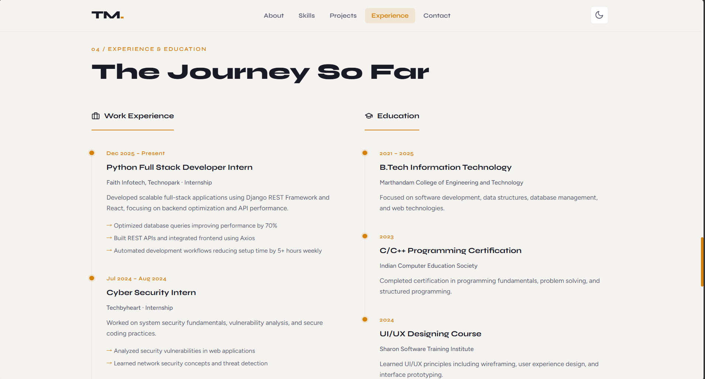 |
| Projects     | 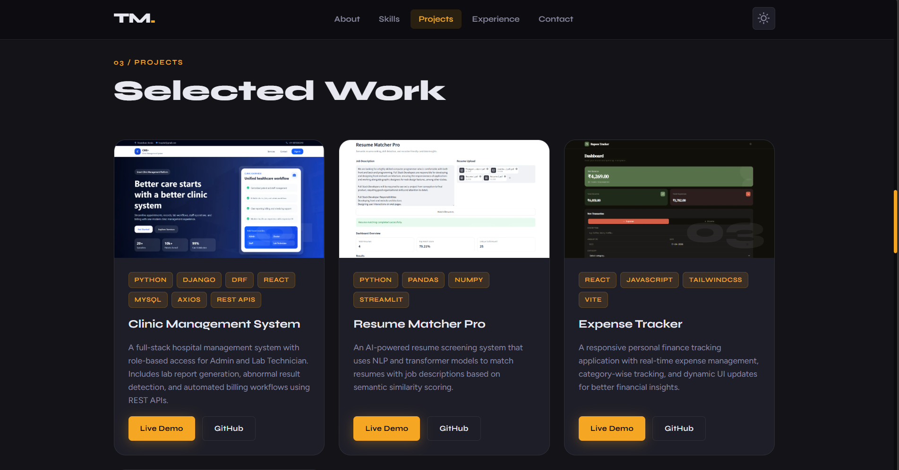 | 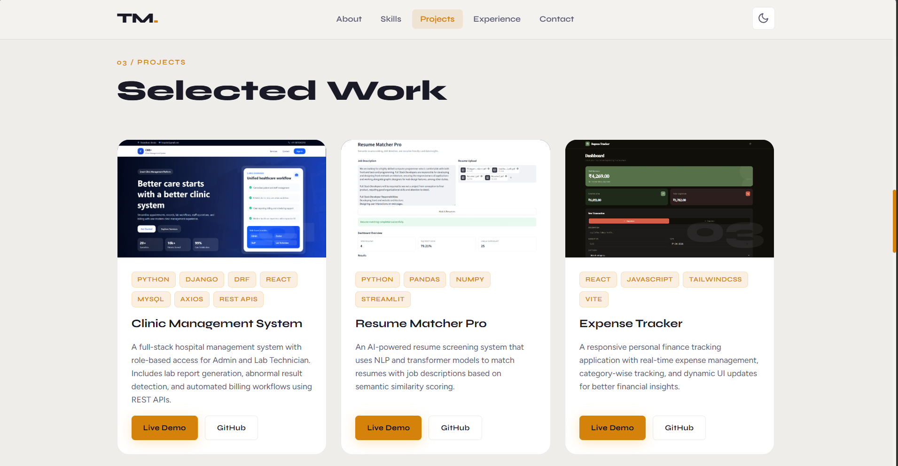 |
| Skills       | 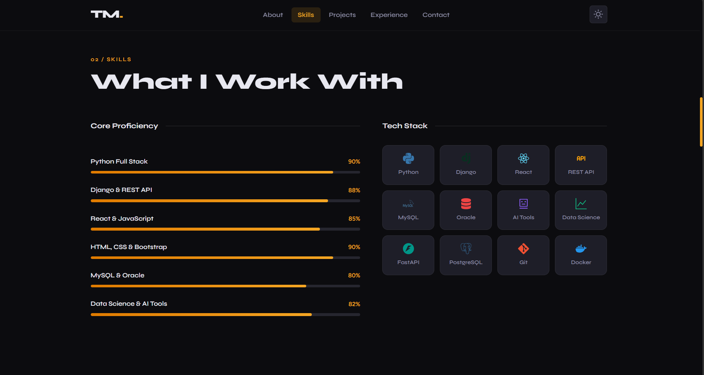 | 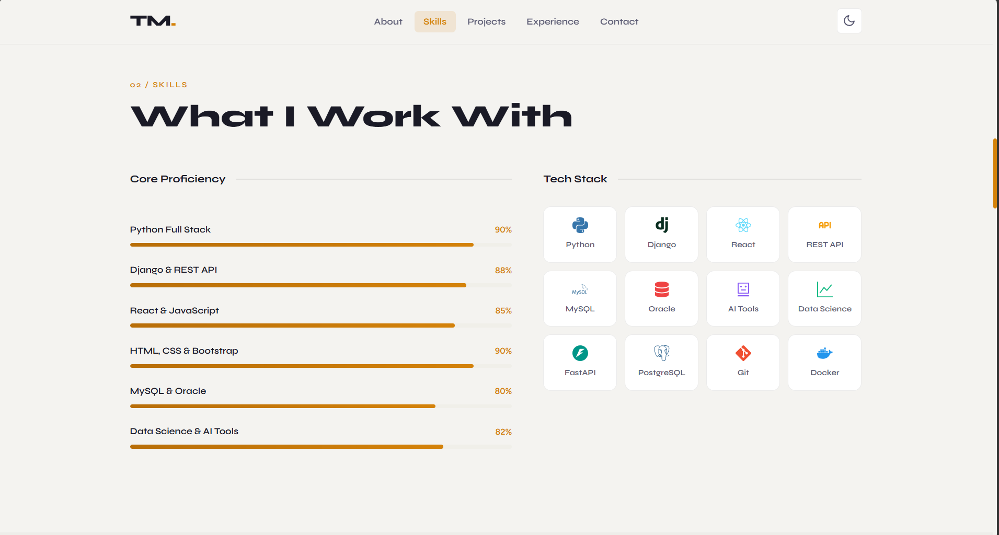 |


##  Run Locally

```bash
git clone https://github.com/manikandan-mk007/portfolio.git
cd portfolio
npm install
npm run dev
```


##  Purpose

### This portfolio represents my ability to:

- Build real-world full stack applications
- Design clean and modern UI
- Integrate frontend and backend systems

##  Contact
- Email: thangamanikandan.it@gmail.com
- LinkedIn: https://www.linkedin.com/in/thangamanikandan-i-560b20396/
